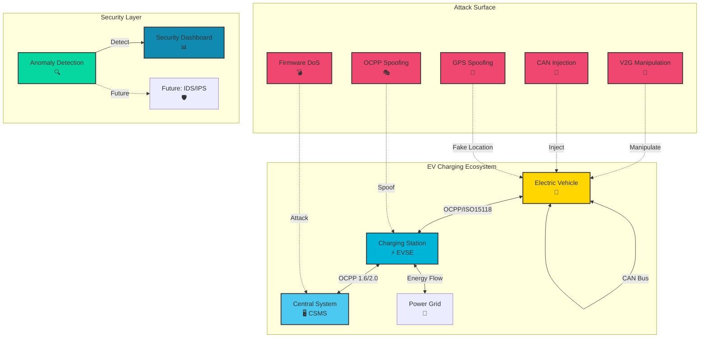
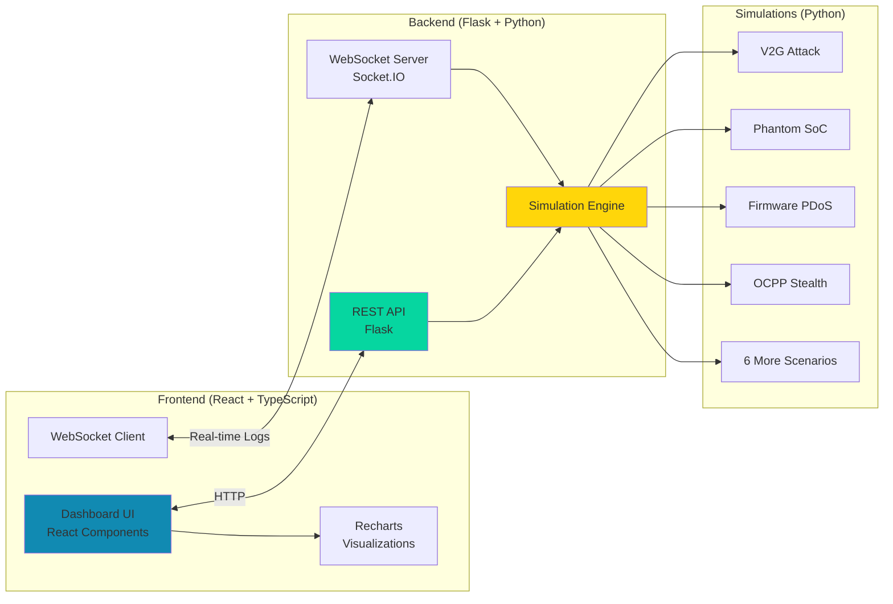
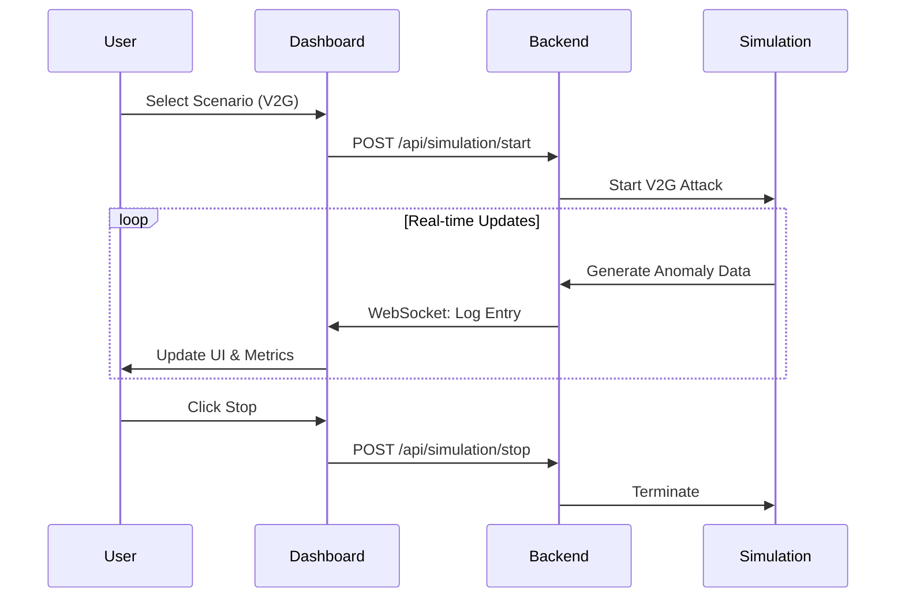

# EV-SEC System Architecture

## System Overview

## Component Architecture

## Data Flow

## Attack Scenario Categories

<table>
<tr>
<th>Category</th>
<th>Scenarios</th>
<th>Primary Impact</th>
</tr>
<tr>
<td><b>Energy Layer</b></td>
<td>
• V2G Manipulation 
• Phantom SoC Report
</td>
<td>Grid destabilization, billing fraud, battery damage</td>
</tr>
<tr>
<td><b>Network Layer</b></td>
<td>
• OCPP Stealth Beaconing 
• Digital Twin Spoofing
</td>
<td>Data exfiltration, man-in-the-middle, service disruption</td>
</tr>
<tr>
<td><b>Firmware Layer</b></td>
<td>
• Firmware P-DoS Attack
</td>
<td>Permanent hardware damage, costly recovery</td>
</tr>
<tr>
<td><b>Physical Layer</b></td>
<td>
• Siren Attack 
• Ghost ECU Injection 
• Charging While Moving
</td>
<td>Safety hazards, physical damage, bypass safety interlocks</td>
</tr>
<tr>
<td><b>UI Layer</b></td>
<td>
• Display Manipulation
</td>
<td>Phishing, social engineering, payment fraud</td>
</tr>
</table>

## Technology Stack

### Frontend
- **Framework:** React 19 + TypeScript
- **Build Tool:** Vite
- **Styling:** TailwindCSS 4, Custom CSS
- **Charts:** Recharts
- **Icons:** Lucide React
- **Animations:** Framer Motion

### Backend
- **Framework:** Flask 3.1
- **WebSocket:** Flask-SocketIO
- **CORS:** Flask-CORS
- **Runtime:** Python 3.10+

### Simulations
- **Protocol:** OCPP 1.6 / 2.0.1
- **Standards:** ISO 15118
- **Networking:** Scapy
- **Analysis:** Python libraries

## Security Detection Logic

### Anomaly Detection Metrics

1. **Energy Flow Inconsistency**
   - Monitor reported vs. actual power transfer
   - Threshold: ±10% deviation triggers warning

2. **Network Anomalies**
   - Latency: Normal <50ms, Anomaly >100ms
   - Packet Loss: Normal <0.1%, Anomaly >1%
   - Payload Size: Detect oversized heartbeats

3. **GPS/Location Verification**
   - Cross-check GPS with geofence
   - Motion detection during charging
   - Threshold: >5m deviation = alert

4. **CAN Bus Monitoring**
   - Detect unauthorized ECU responses
   - Frame replay detection via timestamps
   - Arbitration ID whitelist validation

5. **Firmware Integrity**
   - Hash verification
   - Boot sector validation
   - Rollback protection

## Future Enhancements

- [ ] Machine Learning-based anomaly scoring
- [ ] Integration with Snort/Suricata IDS
- [ ] Honeypot deployment for threat intelligence
- [ ] Real EVSE hardware integration
- [ ] Blockchain-based audit trail
- [ ] Advanced visualization (3D network topology)
